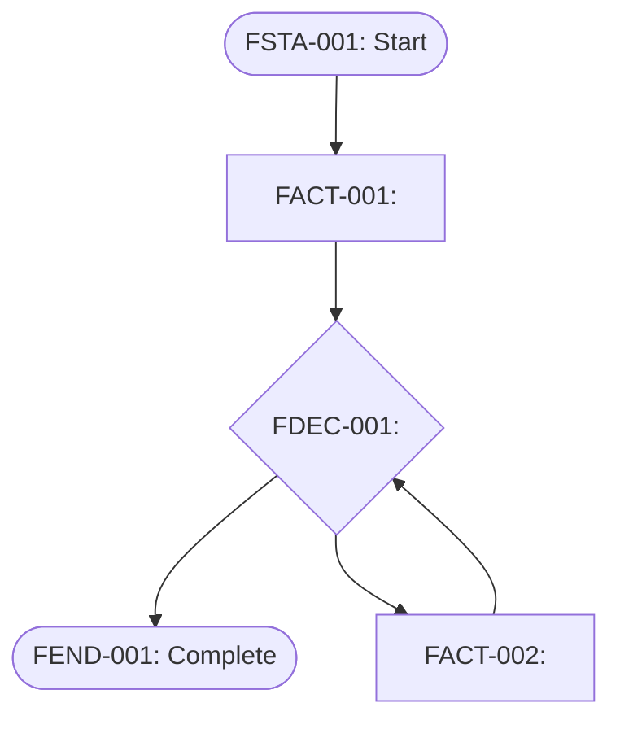

# Flow: <name>

## Graph

## Nodes

### `FACT-001`

<activity description and completion criteria>

### `FDEC-001`

<decision question and outgoing-path criteria>

### `FACT-002`

<corrective activity description and completion criteria>
