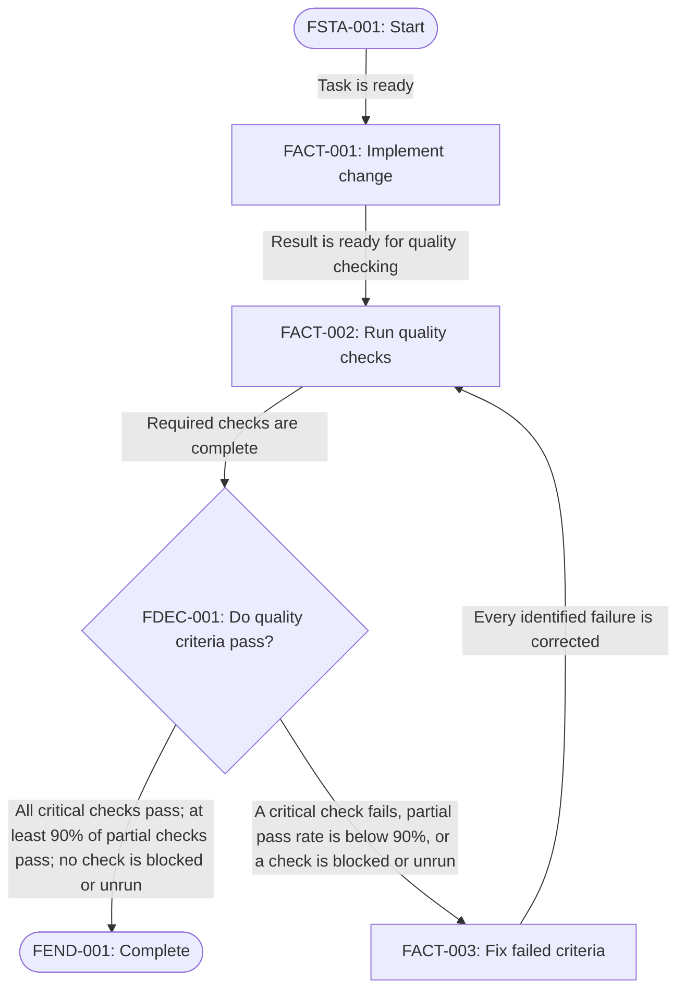

# Flow Contract

A flow describes allowed progress through work as a process-flow diagram.

## Required Sections

A flow has these sections, in order:

1. Title
2. Graph
3. Nodes

## Title

Use:

```md
# Flow: <name>
```

The name identifies the workflow purpose.

## Graph

Use one Mermaid `flowchart` diagram.

The graph must:

- include exactly one start node and one end node
- use a stable, typed ID for every node
- show every allowed transition with an arrow
- label every transition with its transition criterion
- show return paths when rework is allowed
- use the process-flow shape that matches each node type

Use these node-ID prefixes:

- `FSTA-###` — start node
- `FACT-###` — activity node
- `FDEC-###` — decision node
- `FEND-###` — end node

Use a rounded shape for start and end nodes, a rectangle for activity nodes, and a diamond for decision nodes.

When Mermaid requires a source identifier, use an underscore form, such as `FDEC_001`. Put the required hyphenated ID in the node label.

## Transition Criteria

A transition criterion states the evidence required to take a transition. Put it on the transition arrow.

A criterion must:

- state observable evidence, not intent
- define a threshold when one applies
- state how blocked or unrun checks are handled when relevant
- define the completion evidence for a transition into the end node

A transition criterion is not always a decision. Use a decision node only when the process branches on a question. Label each outgoing decision transition with its outcome.

## Failure Recovery

When an activity or decision can fail, the graph must show a failure-recovery path.

A failure outcome must transition to an activity node that corrects the failed criteria. That activity must transition back to the relevant check or decision only when its correction criteria pass.

Do not transition directly from a failed activity or decision back to itself unless that node also performs the corrective activity.

A failure path must not reach the end node until the failed criteria pass.

## Nodes

Add `## Nodes` after the graph.

Describe every activity and decision node with a level-three heading that uses its ID.

```md
### `FACT-001`
Implement the change. Complete this activity when the result is ready for quality checking.

### `FDEC-001`
Decide if the quality criteria pass. Take the pass path only when all defined critical checks pass, at least 90% of defined partial checks pass, and no check is blocked or unrun.

### `FACT-003`
Correct each failed criterion. Complete this activity when every identified failure is corrected and the result is ready for repeated quality checks.
```

Each description must:

- match one graph node
- describe one coherent activity or decision
- state activity completion criteria when applicable
- state the question and outgoing-path criteria for a decision
- use plain, direct language

Do not describe the start or end node.

## Example



## Scope

A flow guides task selection. It does not define task text, worker selection, persistent state, transition enforcement, or execution instructions.
